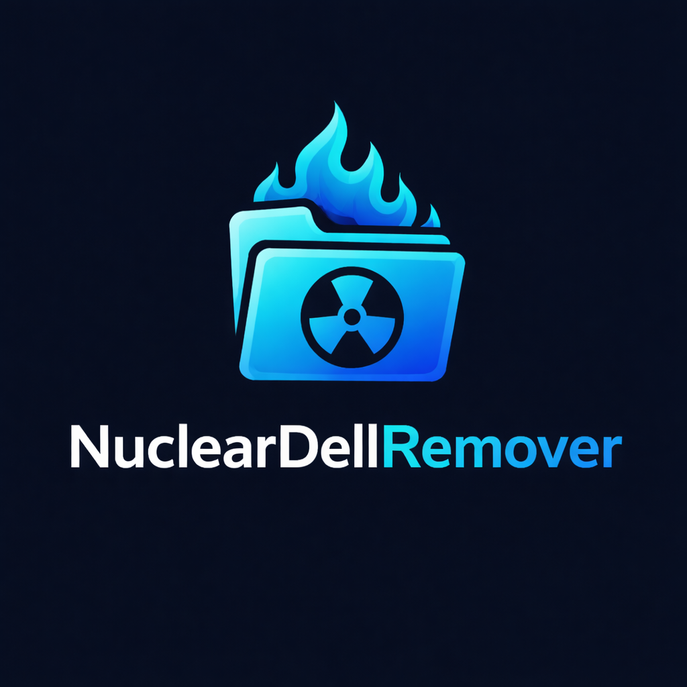

<p align="center">
  
</p>

<h1 align="center">NuclearOEMRemover</h1>

<p align="center">
  Purpose-built Windows cleanup interface for Dell, HP, and Lenovo OEM software.
</p>

<p align="center">
  
  
  
</p>

> `NuclearDellRemover.ps1` is the complete app: GUI and cleanup engine in one self-contained script.

## What It Does

NuclearOEMRemover removes preinstalled OEM utilities, background agents, update helpers, recovery plugins, scheduled tasks, startup entries, registry remnants, and filesystem leftovers through a native Windows GUI. It auto-detects the manufacturer or lets you target a specific OEM.

Start with the default dry run for a no-change audit and HTML report, then run live cleanup when the findings look right.

## Cleanup Coverage

| Phase | Coverage |
| --- | --- |
| Processes | Stops active OEM agents and catches respawns in a second pass |
| Services | Stops, disables, and deletes OEM services |
| AppX Packages | Removes installed and provisioned Store packages |
| Win32 Apps | ARP uninstallers + MSI + InstallShield + winget + dynamic Package Cache walk + manual fallbacks, with post-uninstall polling and a SupportAssist version gate |
| Scheduled Tasks | Removes OEM tasks and task folders |
| Registry | Removes OEM keys and startup entries |
| Filesystem | Removes program data, profile, Start Menu, and install remnants; sweeps Public/current-user desktop `.lnk` shortcuts |
| Reinstall Blocking | Blocks driver delivery through Windows Update, populates the Device Installation Restrictions `DenyDeviceIDs` policy with detected OEM hardware IDs, and applies CDM/Iris settings to every user profile including `Default` for new users |
| Residue Cleanup | `pnputil` driver package removal, OEM firewall rules, OEM Defender exclusions, pending BITS transfers |

## Supported OEMs

| OEM | Detected Via | Primary Targets |
| --- | --- | --- |
| Dell | `Dell` or `Alienware` in manufacturer | SupportAssist, Dell Optimizer, Digital Delivery, Command Update, MyDell, Dell Pair, Peripheral Manager, Display Manager, Trusted Device, PC-Doctor |
| HP | `HP` or `Hewlett` in manufacturer | HP Support Assistant, Wolf Security, Sure Click, Touchpoint Analytics, HP Smart |
| Lenovo | `Lenovo` in manufacturer | Vantage, ImController, System Update, Commercial Vantage, Lenovo Now |

## Usage

### GUI

```powershell
.\NuclearDellRemover.ps1
```

The interface defaults to dry run, self-elevates if needed, streams live output, tracks cleanup phases, and writes a per-run report, log, and undo manifest.

### Unattended (Intune / SCCM / RMM / scheduled task)

```powershell
# Audit first
.\NuclearDellRemover.ps1 -Unattended -DryRun

# Live cleanup, keep Dell Command Update for BIOS/driver management
.\NuclearDellRemover.ps1 -Unattended -KeepDellCommandUpdate

# Force removal of SupportAssist even at or above the version gate
.\NuclearDellRemover.ps1 -Unattended -Force

# Seed the hardware-ID deny list with extras collected from a fleet-wide audit
.\NuclearDellRemover.ps1 -Unattended -HardwareIdSeedsFile C:\Fleet\alienware-hwids.txt
```

`-Unattended` runs the engine headless and auto-elevates. Exit codes: `0` = clean (or dry-run complete), `2` = verification found remnants (restart may clear), `3` = exception during phase execution.

### Hardware-ID seed file format

One hardware ID per line. Lines beginning with `#` are comments. Blank lines are ignored.

```text
# Alienware Command Center controller (example - verify against your hardware)
USB\VID_187C&PID_0529
ROOT\AlienwareOSDPackage

# Dell Data Vault driver
ROOT\DDVDD
```

Collect hardware IDs from a reference machine with:

```powershell
Get-PnpDevice | Where-Object { $_.FriendlyName -match 'Dell|Alienware|SupportAssist' } |
    ForEach-Object { Get-PnpDeviceProperty -InstanceId $_.InstanceId -KeyName DEVPKEY_Device_HardwareIds } |
    Select-Object -ExpandProperty Data -Unique
```

### Running the test suite

```powershell
# Convenience runner (auto-installs Pester 5 if needed)
.\Invoke-Tests.ps1 -InstallIfMissing

# Or manually
Install-Module Pester -MinimumVersion 5.0.0 -Scope CurrentUser
Invoke-Pester -Path .\tests\NuclearDellRemover.Tests.ps1 -Output Detailed
```

44 tests, no admin rights required, no system changes. Tests dot-source the main script in `-LoadOnly` mode. CI runs the suite on every push / PR via [GitHub Actions](.github/workflows/test.yml).

### Further reading

- [docs/undo-manifest-schema.md](docs/undo-manifest-schema.md) - JSON schema of the undo manifest, action vocabulary, sample consumption snippets, and why it is audit-only.
- [examples/hardware-id-seeds/](examples/hardware-id-seeds/) - template seed files and discovery workflow for `-HardwareIdSeedsFile`.

## GUI Controls

| Control | Purpose |
| --- | --- |
| OEM Target | Auto-detects the current PC or targets Dell, HP, Lenovo, or every supported profile. |
| Dry Run | Report-only mode. No destructive actions are taken. Enabled by default. |
| Block Reinstall | Blocks WU driver delivery, populates the Device Installation Restrictions hardware-ID deny list (live-detected + seed file), and applies CDM/Iris settings to every user profile. |
| Clean Filesystem | Removes OEM directories across all user profiles (including the Default template), Start Menu entries, install leftovers, and desktop shortcuts. |
| Clear Residue | Drops OEM driver packages (`pnputil`), firewall rules, Defender exclusions, and pending BITS transfers. |
| Keep Dell Command Update | Preserves DCU for BIOS/driver management and applies silent-mode lockdown keys so it stops popping up. |
| Force | Bypasses the SupportAssist version gate (ignored unless SupportAssist is at or above the gate). |
| Create Restore Point | Creates a System Restore checkpoint before live runs. Ignored in dry-run mode. |
| Open Report | Opens the generated HTML report when the run finishes. |
| Start Dry Run / Start Live Cleanup | Runs the selected cleanup profile with the current options. |
| Stop Run | Confirms before stopping an active cleanup process. |
| Open Report / Open Log | Opens the latest generated artifacts from the current GUI session. |

## Report

Each GUI or unattended run writes a polished HTML report, text log, and JSON undo manifest to `%TEMP%` with a timestamped filename.

The report includes system context, target OEMs, phase counts (including Residue), verification status, dry-run state, detailed result rows, and the log location. The undo manifest records every destructive change with timestamp, phase, action, target, before value, and after value for audit or reversal.

## Requirements

- Windows 11
- Administrator privileges
- PowerShell 5.1 or newer

## Notes

- Restart after live cleanup if Windows reports pending removals or verification finds remnants.
- Some OEM tools protect their uninstallers; the script includes Dell-specific fallback paths plus a dynamic `%ProgramData%\Package Cache` walk that catches newer installer versions without a static allowlist.
- `-KeepDellCommandUpdate` is the recommended sysadmin default on fleet Dell machines - it lets DCU keep delivering BIOS and driver updates while the rest of the Dell surface is nuked and silenced.
- If Alienware Command Center or Dell Optimizer kept coming back before, the new `Block Reinstall` phase in v1.3.0 adds the Windows Update driver exclusion and the Device Installation Restrictions hardware-ID deny list that the Dell community recommends.
- Logs, reports, and undo manifests are written per run to `%TEMP%`.
